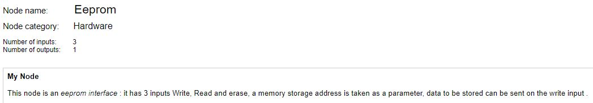

 # nBlocksStudio Eeprom 
 ## NODE
 
 
This node is an eeprom interface : it has 3 inputs Write, Read and erase, a memory storage address is taken as a parameter, data to be stored can be sent on the write input 

 Author: Ian Aherne  
